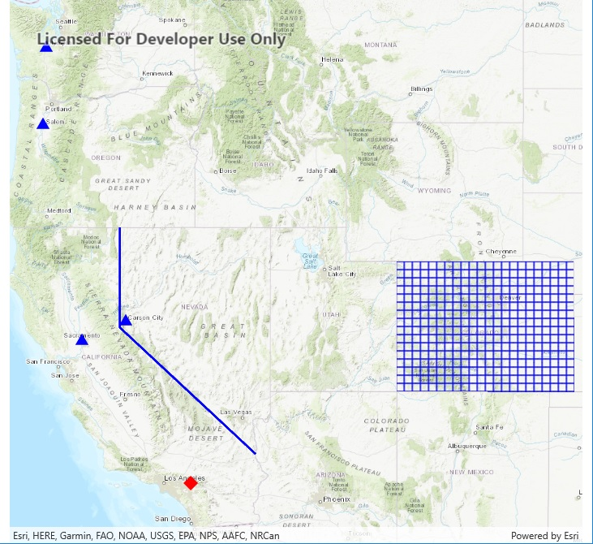

# Create geometries

This sample demonstrates simple ways to create different types of Geometry. The geometries are added as Graphics to a GraphicsOverlay and displayed in a MapView. An Envelope is used to set the Viewpoint of the MapView.

