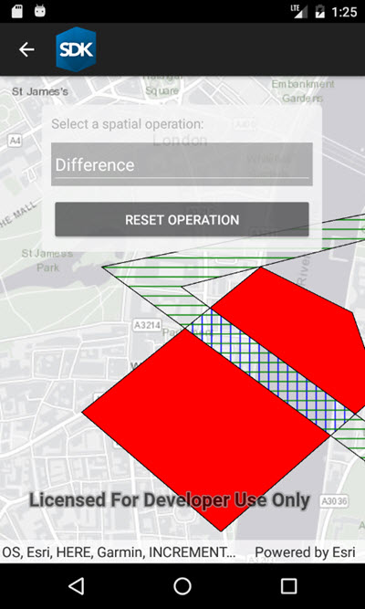

# Spatial operations

Demonstrates how to use the GeometryEngine to perform geometry operations between overlapping polygons in a GraphicsOverlay.

### Instructions

The sample provides a drop down on the top, where you can select a geometry operation. When you choose a geometry operation, the application performs this operation between the overlapping polygons and applies the result to the geometries.