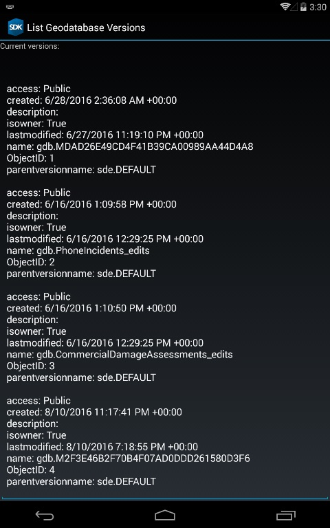

# List geodatabase versions

This sample demonstrates how to use GeoprocessingTask to get available geodatabase versions from the enterprise geodatabase. Geoprocessing task will return the versions as a table that is shown to the user in a list. This is a good example how to use geoprocessing on mapless application.

