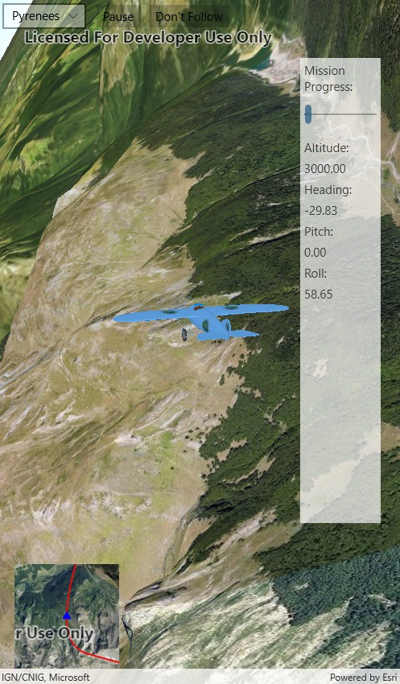

# Animate 3D Graphic

This sample demonstrates how to animate a graphic's position and follow it using a camera controller.

## Instructions

Click-and-drag to pan the SceneView, orbiting the moving plane. Click "Don't Follow" to switch to the default camera controller, which does not orbit the plane.
The plane's route is shown on the inset map in the bottom left corner of the window. The progress through the plane's mission is shown in the panel on the right.
There is a drop-down box on the top left part of the window for selecting a mission (route) for the plane.

Note that this is a graphics-intensive sample; performance may be degraded in certain situations (such as viewing over Remote Desktop or in a simulator).
