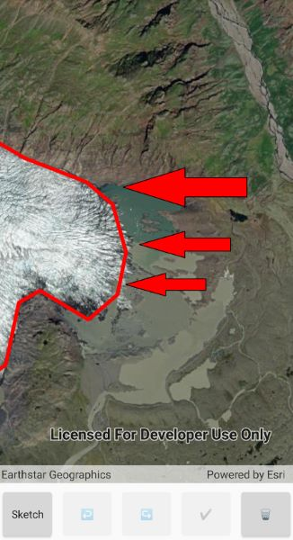

# Sketch graphics on the map

This sample demonstrates how to interactively sketch and edit graphics in the map view and display them in a graphics overlay. You can sketch a variety of geometry types and undo or redo operations.

## Instructions

1. Click the 'Sketch' button.
2. Choose a sketch type from the drop down list.
3. While sketching, you can undo/redo operations.
4. Click 'Done' to finish the sketch.
5. Click 'Edit', then click a graphic to start editing.
6. Make edits then click 'Done' or 'Cancel' to finish editing.
