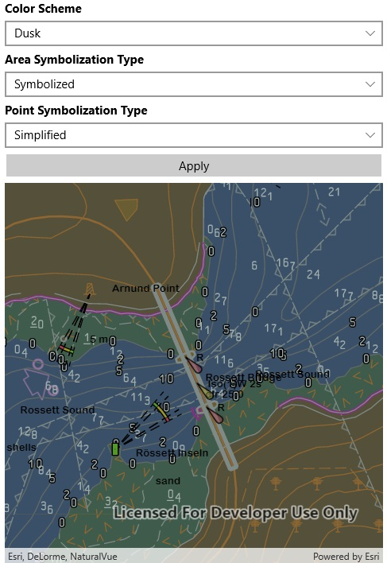

# Change ENC display settings

This sample demonstrates how to control ENC environment settings. These settings apply to the display of all ENC content in your app.

## Instructions

This sample automatically downloads ENC data from ArcGIS Online before displaying the map.
