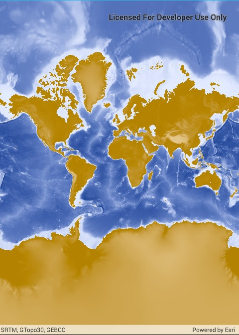

# ArcGIS map image layer

Add an ArcGIS Map Image Layer from a URL to a map.

## Use case

`ArcGISMapImageLayer` instances are rendered server side as a single raster image, so they always show the latest data at the time of the request. Since the data is rendered as a single image, it can have performance benefits versus a feature layer with complex geometries.

## How it works

1. Create a new `Map` and set it to a `MapView`.
2. Create a new `ArcGISMapImageLayer` with an input URL.
3. Add the layer to the map.

## Relevant API

* Map
* ArcGISMapImageLayer
* MapView

## Tags

ArcGIS dynamic map service layer, ArcGISMapImageLayer, layers
