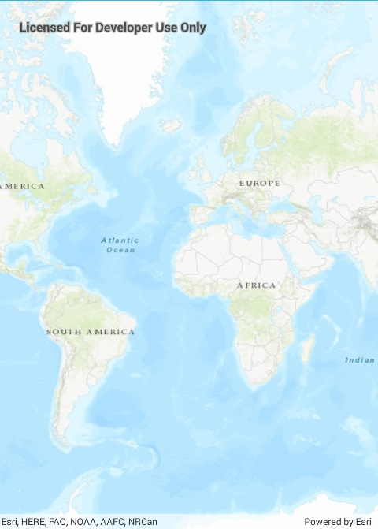

# ArcGIS tiled layer

Load an ArcGIS tiled layer from a URL.

## Use case

An `ArcGISTiledLayer` consumes raster tiles provided by an ArcGIS service or a tile package (.tpk & .tpkx). Dividing a raster into tiles allows the map to provide relevant tiles and level of detail to the user when panning and zooming.

## How it works

1. Add an `ArcGISTiledLayer` from an ArcGIS Online service URL to the `ArcGISMap` as an operational layer.

## Relevant API

* Map
* ArcGISTiledLayer
* MapView

## Additional information

`ArcGISTiledLayer` supports both .tpk and .tpkx file formats.  

## Tags

ArcGISTiledLayer, layers, tile
