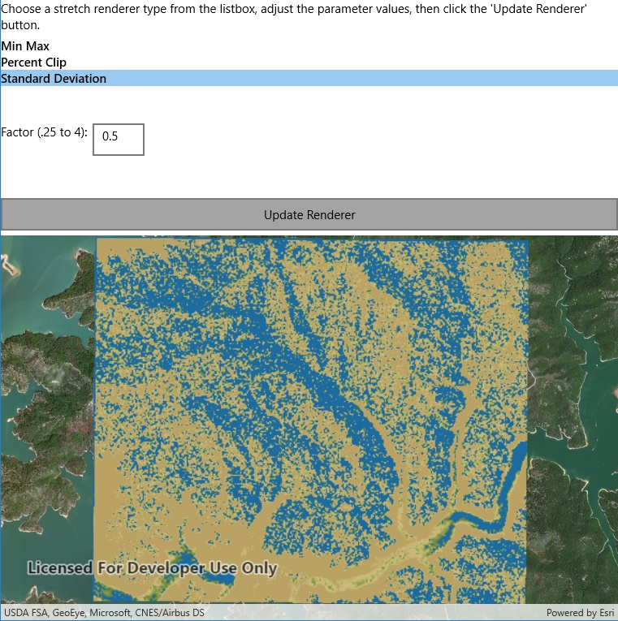

# Stretch renderer

This sample demonstrates how to use stretch renderer on a raster layer.

## Instructions

Choose a stretch renderer type from the listbox to change the settings for the stretch renderer.
The sample allows you to change the stretch type and the parameters for each type. Click/tap the 'Update Renderer' button to update the raster.
Experiment with settings for the various types for stretch parameters. For example, setting the renderer to use stretch parameters:
Min Max with a min value of 50 and a max value of 200 will stretch between these pixel values. A higher min value will remove more of the lighter pixels values whilst a lower max will remove more of the darker.
Percent Clip with a min value of 2 and a max value of 98 will stretch from 2% to 98% of the pixel values histogram. A lower min and higher max percentage will render using more of the original raster histogram.
Standard Deviation with a factor of 2.0 will stretch 2 standard deviations from the mean. A higher factor (further from the mean) will render using more of the original raster histogram.
