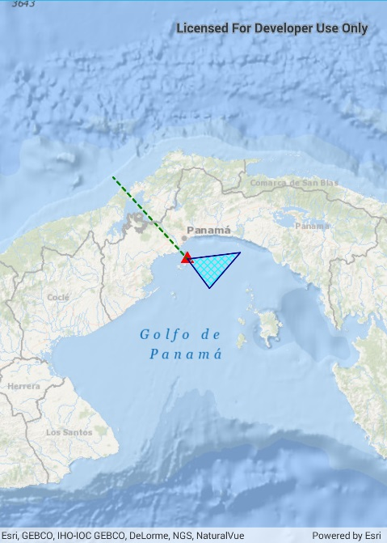

#Create a feature collection layer

This samples demonstrates how to create a new feature collection with several feature collection tables. The collection is displayed in the map as a feature collection layer.

### Instructions

