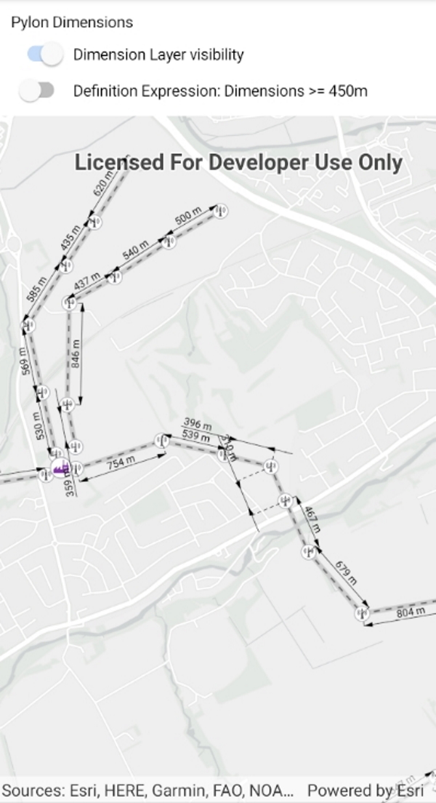

# Display dimensions

Display dimension features from a mobile map package.

## Use case

Dimensions show specific lengths or distances on a map. A dimension may indicate the length of a side of a building or land parcel, or the distance between two features, such as a fire hydrant and the corner of a building.

## How to use the sample

When the sample loads, it will automatically display the map containing dimension features from the mobile map package. The name of the dimension layer containing the dimension features is displayed in the controls box. Control the visibility of the dimension layer with the "Dimension Layer visibility" check box, and apply a definition expression to show dimensions of greater than or equal to 450m in length using the "Definition Expression" checkbox.

## How it works

1. Load a `MobileMapPackage` that contains `DimensionLayer`
2. After it successfully loads, get the map from the mmpk and add it to the map view: `mobileMapPackage.Maps.First()`.
3. Get the `DimensionLayer` from the map view and set the name of the layer to the UI with `dimensionLayer.Name`.
4. Control the dimension layer's visibility with `dimensionLayer.IsVisible` and set a definition expression with `dimensionLayer.DefinitionExpression`.

## Relevant API

* DimensionLayer
* MobileMapPackage

## About the data

This sample shows a subset of the Edinburgh, Scotland network of pylons, substations, and powerlines within an [Edinburgh Pylon Dimensions mobile map package](https://arcgis.com/home/item.html?id=f5ff6f5556a945bca87ca513b8729a1e), digitized from satellite imagery. Note the data is intended as illustrative of the network only.

## Additional information

Dimension layers can be taken offline from a feature service hosted on ArcGIS Enterprise 10.9 or later, using the [GeodatabaseSyncTask](https://developers.arcgis.com/net/api-reference/api/net/Esri.ArcGISRuntime/Esri.ArcGISRuntime.Tasks.Offline.GeodatabaseSyncTask.html). Dimension layers are also supported in mobile map packages or mobile geodatabases created in ArcGIS Pro 2.9 or later.

## Tags

dimension, layer, mmpk, mobile map package, utility