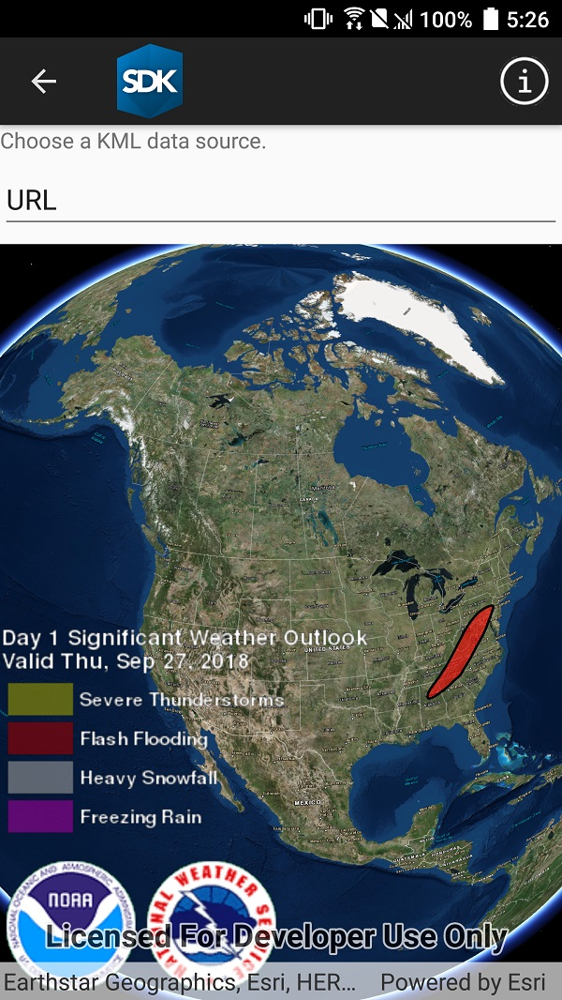

# Display KML

This sample demonstrates how to load and display KML files from:

* URL
* Local file
* Portal item

## How to use the sample

Use the UI to select a source. A KML file from that source will be loaded and displayed in the map. 

## Relevant API

* `KmlLayer`
* `KmlLayer(Uri)`
* `KmlLayer(PortalItem)`

## Offline data

This sample uses [US state capitals](https://arcgisruntime.maps.arcgis.com/home/item.html?id=324e4742820e46cfbe5029ff2c32cb1f) KML file. It is downloaded from ArcGIS Online automatically.

## About the maps

This sample displays three different KML files:

* From URL - this is a map of the significant weather outlook produced by NOAA/NWS. It uses KML network links to always show the latest data.
* From local file - this is a map of U.S. state capitals. It doesn't define an icon, so the default pushpin is used for the points.
* From portal item - this is a map of U.S. states.

## Tags

KML, OGC, KMZ, Keyhole