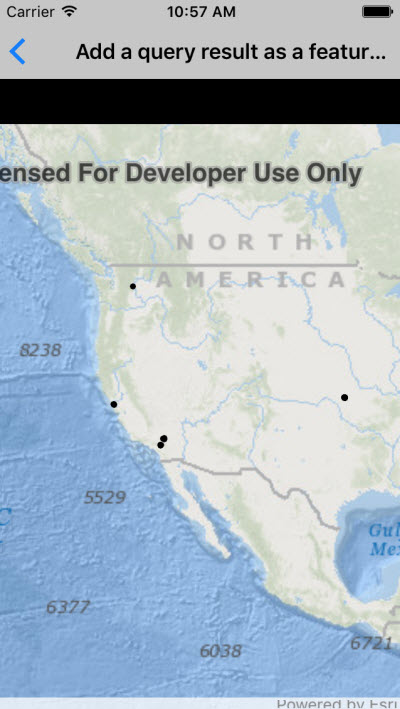

# Feature collection layer (Query)

Create a feature collection layer to show a query result from a service feature table. The feature collection is then displayed on a map with a feature collection layer.

## How to use the sample

Simply run the app.

## How it works

1. Call `featureTable.QueryFeaturesAsync(queryParameters)`.
2. Create a `FeatureCollectionTable` with the resulting features.
3. Use the feature collection table to create a `FeatureCollection`.
4. Create a `FeatureCollectionLayer` referring to the feature collection.
5. Display the layer.

## Relevant API

* FeatureCollection
* FeatureCollectionLayer
* FeatureCollectionTable
* FeatureQueryResult
* QueryParameters
* ServiceFeatureTable

## Tags

Search and Query, feature collection layer
