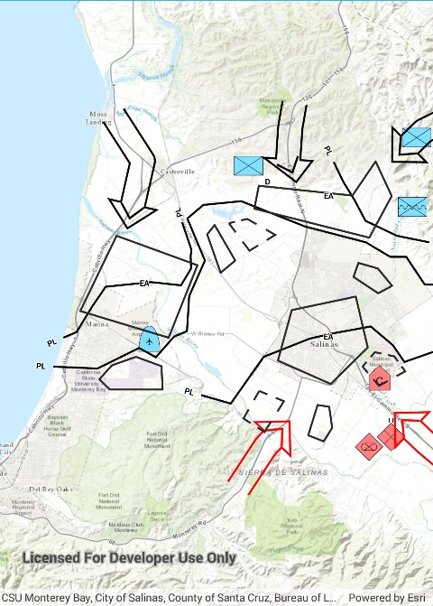

# Feature layer dictionary renderer

Demonstrates how to apply a dictionary renderer to a feature layer and display mil2525d graphics. The dictionary renderer creates these graphics using a mil2525d style file and the attributes attached to each feature within the geodatabase.

