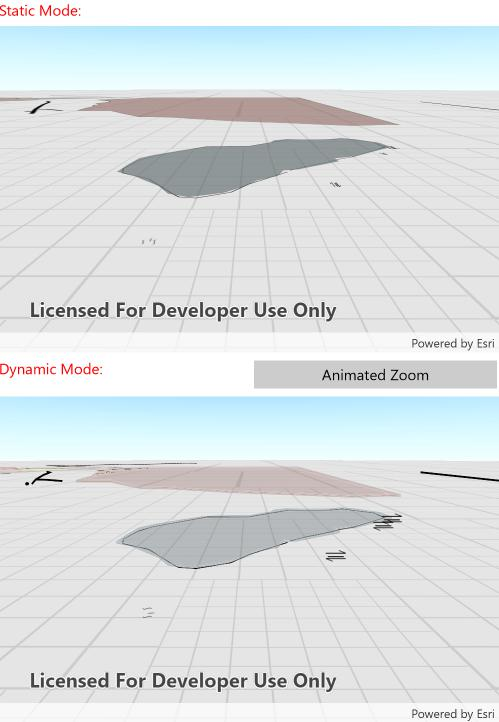

# Feature layer rendering mode (Scene)

This sample demonstrates how to use load settings to change the preferred rendering mode for a scene. Static rendering mode only redraws features periodically when a sceneview is navigating, while dynamic mode dynamically re-renders as the scene moves.

## Instructions

Press the 'Animated Zoom' button to trigger a zoom. Observe the differences between the two scenes.
