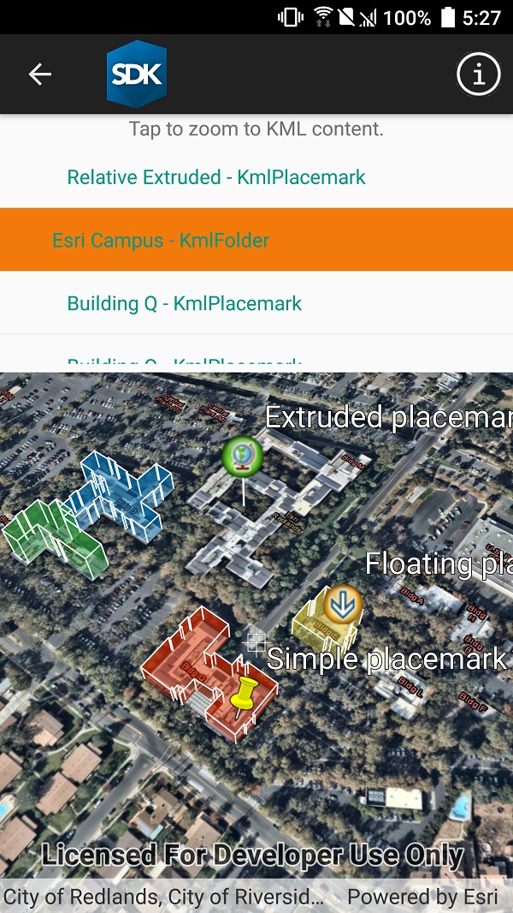

# List KML contents

List the contents of a KML file. KML files can contain a hierarchy of features, including network links to other KML content.

## How to use the sample

The contents of the KML file are shown in a tree. Select a node to zoom to that node. Not all nodes have an extent that can be zoomed to (e.g. screen overlays).

## How it works

1. The KML file is added to the scene as a layer.
2. Root nodes from `KmlDataset.RootNodes` is recursively explored to create a view model.
  * Each node is enabled for display at this step. KML files may include nodes that are turned off by default.
3. When you click on a node in the tree, that node's `Extent` property is used to zoom via `SceneView.SetViewpointAsync`.

## Relevant API

* `KmlNode.Extent`
* `KmlLayer`
* `KmlDataset`

## About the data

This is an example KML file meant to demonstrate how Runtime supports several common features.

## Tags

KML, KMZ, OGC, Keyhole