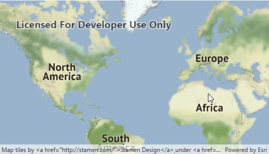

# Web tiled layer

Display a tiled web layer.

## How to use the sample

The web tiled basemap will load automatically when the sample starts.

## How it works

1. Create a `WebTiledLayer` from a URL and a list of subdomains.
2. Create a new `Basemap` from the layer.
3. Update the attribution on the layer. Note: this is a necessary step because web tiled services don't have associated service metadata.
4. Display the basemap.

## Relevant API

* Basemap
* WebTiledLayer

## About the data

The basemap in this sample is provided by [Stamen Design](maps.stamen.com). Stamen publishes tiled services based on OpenStreetMap data with several unique styles applied.

## Additional information

Web tiled services use a uniform addressing scheme with pre-rendered tiles. Image tiles are accessed via a URL template string, with parameters for subdomain, level, column, and row.

* Subdomain is optional and allows Runtime to balance requests among multiple servers for enhanced performance.
* Level, row, and column select the tiles to load based on the visible extent of the map.

For more information about web tiled layers, see the following resources:

* [Wikipedia: tiled web maps](https://en.wikipedia.org/wiki/Tiled_web_map)
* [ArcGIS Pro: Share a web tile layer](http://pro.arcgis.com/en/pro-app/help/sharing/overview/web-tile-layer.htm)

## Tags

OGC, Open Street Map, OpenStreetMap, WebTiledLayer, stamen.com, tiled
