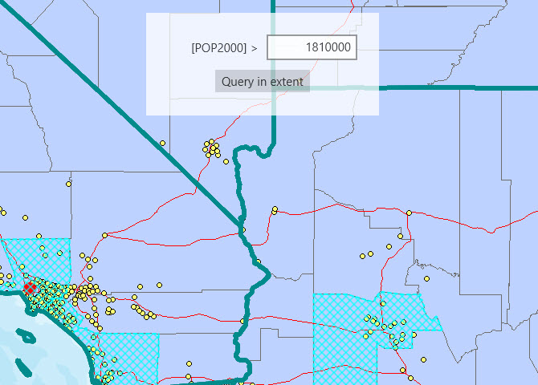

# Query a map image sublayer

This sample demonstrates how to execute an attribute and spatial query on the sublayers of an ArcGIS map image layer. Sublayers of an ArcGISMapImageLayer may expose a ServiceFeatureTable through a Table property.This allows you to perform the same queries available when working with a table from a FeatureLayer: attribute query, spatial query, statistics query, query for related features, and so on.

## Instructions

1. Launch the sample, the map displays at an extent where individual states, counties, and cities can be seen clearly.
2. Provide a numeric value for the population query(values under 1810000 will produce a selection in all layers).
3. Click the `Query` button to find all features in the current map extent that have a population greater than the value entered.
   - Any current selection is cleared from the map.
   - If a non - numeric value was entered, an error message is displayed.
4. All features(cities, counties, or states) meeting the query criteria are selected in the map.
   - If no features meet the query criteria, a message displays stating zero features were selected.
5. Experiment with different map extents and population values and see the results.
