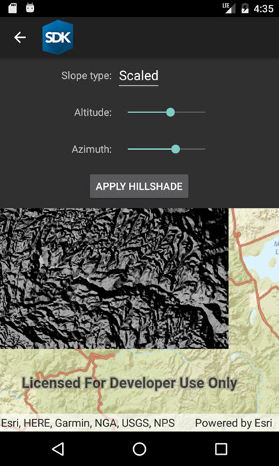

# Raster hillshade renderer

Use a hillshade renderer on a raster.

## How to use the sample

Configure the options for rendering, then tap 'Apply hillshade'.

## How it works

1. The parameters provided by the user are passed to `HillshadeRender` at instantiation: `new HillshadeRenderer(mAltitude, mAzimuth, mZFactor, mSlopeType, mPixelSizeFactor, mPixelSizePower, mOutputBitDepth);` which returns a `RasterRenderer`. The `RasterRenderer` is then added to the `RasterLayer`.

## Offline data

This sample downloads the following items from ArcGIS Online automatically:

* [srtm-hillshade.zip](https://www.arcgis.com/home/item.html?id=134d60f50e184e8fa56365f44e5ce3fb) - SRTM DEM

## Tags

Visualization, hillshade, raster, shadow, slope
