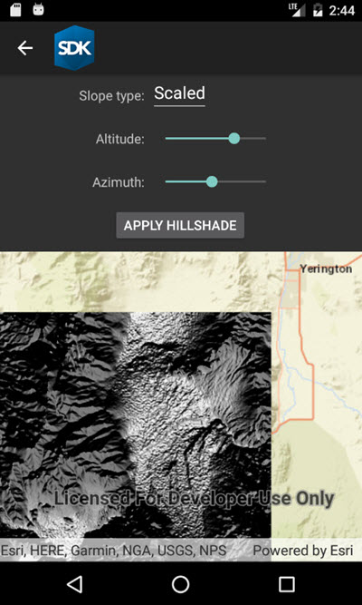

# Hillshade renderer

Apply a hillshade renderer to a raster.

## Use case

An environmental agency may track coastal erosion by comparing images of an area taken over a a longer period of time with hillshade renderers applied.

## How to use the sample

Choose and adjust the settings to update the hillshade renderer on the raster layer. The sample allows you to change the Altitude, Azimuth, and Slope Type.

## How it works

1. Create a `Raster` from a grayscale raster file.
2. Create a `RasterLayer` from the raster.
3. Create a `Basemap` from the raster layer and set it to the map.
4. Create a `HillshadeRenderer`, specifying the slope type and other properties, `new HillshadeRenderer(Altitude, Azimuth, ZFactor, SlopeType, PixelSizeFactor, PixelSizePower, OutputBitDepth)`.
5. Set the hillshade renderer to be used on the raster layer with `rasterLayer.Renderer`.

## Relevant API

* Basemap
* HillshadeRenderer
* Raster
* RasterLayer

## Offline data

This sample uses a [digital elevation map](https://www.arcgis.com/home/item.html?id=134d60f50e184e8fa56365f44e5ce3fb) from ArcGIS Online.

## Tags

altitude, angle, azimuth, raster, slope, visualization
