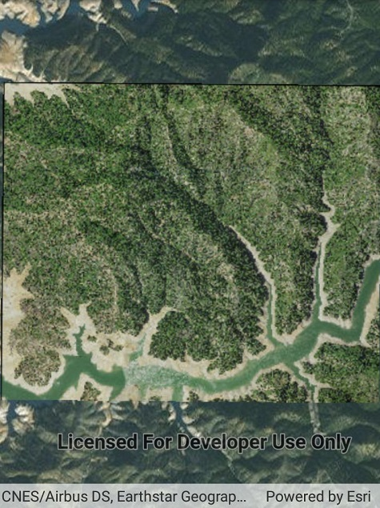

# Raster layer (file)

Create and use a raster layer made from a local raster file.

## How to use the sample

Run the app and allow read permission.

## How it works

1. Create a `Raster` from a raster file stored locally on the device.
2. Create a `RasterLayer` from the `Raster`.
3. Add it as an operational layer with `Map.OperationalLayers.Add(...)`.

## Relevant API

* Raster
* RasterLayer

## Offline data

This sample downloads the following items from ArcGIS Online automatically:

* [raster-file.zip](https://www.arcgis.com/home/item.html?id=7c4c679ab06a4df19dc497f577f111bd) - Tif raster file

## Tags

Layers, raster
