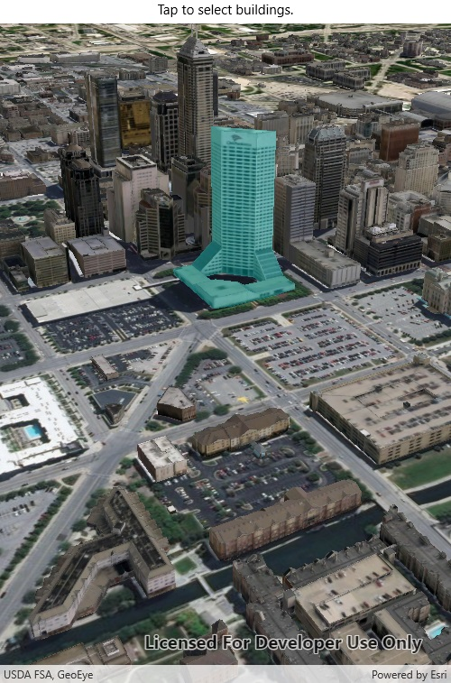

# Scene Layer Selection
Identify GeoElements in a scene layer.

## How to use the sample
Click on a building in the scene layer to select it. Deselect buildings by clicking away from the buildings.

## How it works
1. Create an `ArcGISSceneLayer` passing in the URL to a scene layer service.
2. Use `sceneView.setOnTouchListener` to get the screen tap location `screenPoint`.
3. Call `sceneView.identifyLayersAsync(sceneLayer, screenPoint, tolerance, false, 1)` to identify features in the scene.
4. From the resulting `IdentifyLayerResult`, get the list of identified `GeoElements` with `result.getElements()`.
5. Get the first element in the list, checking that it is a feature, and call `sceneLayer.selectFeature(feature)` to select it.

## About the data

This sample shows an [Indianapolis building layer](https://www.arcgis.com/home/item.html?id=d5271294f1e04ac9acc5b36feaab7859) from ArcGIS Online.

## Relevant API
* `Scene`
* `ArcGISSceneLayer`
* `SceneView`

## Tags
Search and Query, Buildings, scene, model, 3D