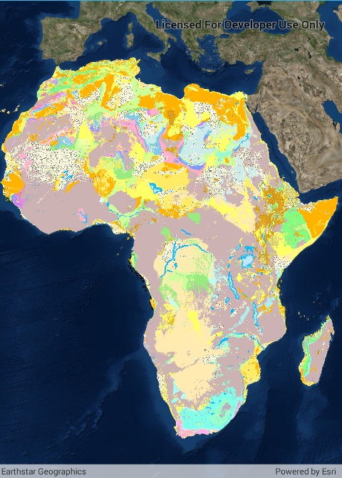

# WMS Layer URL

Display a WMS layer using a WMS service URL.

## How to use the sample

The map will load automatically when the sample starts.

## How it works

1. Create a `WmsLayer` specifying the URL of the service and the names of layers you want to display.
    * **Note**: The name comes from the `Name` property, not the `Title` property. On many services, the title is human-readable while the name is a numeric identifier.
2. Add the layer to the map as an operational layer.

## Relevant API

* Map
* MapView
* WmsLayer

## About the data

This sample uses a [U.S. National Weather Service radar map](https://nowcoast.noaa.gov/arcgis/services/nowcoast/radar_meteo_imagery_nexrad_time/MapServer/WMSServer?request=GetCapabilities&service=WMS). Because WMS services generate map images on-the-fly, this layer is always up-to-date with the latest [NOAA NEXRAD radar](https://www.ncdc.noaa.gov/data-access/radar-data/nexrad) observations.

## Tags

OGC, WmsLayer, web map service
