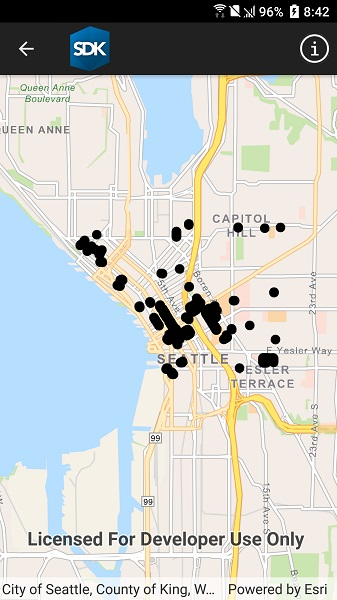

# Load WFS with XML query

Load a WFS feature table using an XML query.

## Use case

Runtime `QueryParameters` objects can't represent all possible queries that can be made against a WFS feature service. You can provide queries as raw XML strings, allowing you to access query functionality not available with `QueryParameters`.

## How it works

1. Create a `WfsFeatureTable` and a `FeatureLayer` to visualize the table.
2. Set the feature request mode to `ManualCache`. 
3. Call `PopulateFromServiceWithXmlAsync` to populate the table with features.

## Relevant API

* WfsFeatureTable
* WfsFeatureTable.AxisOrder
* WfsFeatureTable.PopulateFromServiceWithXmlAsync

## About the data

This service shows trees in downtown Seattle and the surrounding area. XML is used to limit results to only trees of the species *Tilia cordata*.

For additional information, see the underlying service on [ArcGIS Online](https://arcgisruntime.maps.arcgis.com/home/item.html?id=1b81d35c5b0942678140efc29bc25391).

## Tags

OGC, WFS, feature, web, service, XML, query