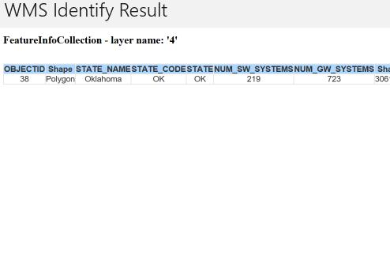

# Identify WMS features

This sample demonstrates how to identify WMS features and display the associated content for an identified WMS feature.

## Instructions

Tap to identify a feature. Note: the service returns HTML regardless of whether there was an identify result. The sample uses a heuristic to not show empty results.
