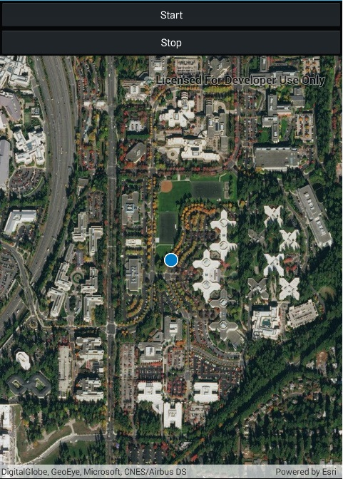

# Display device location with autopan modes

Display your current position on the map, as well as switch between different types of auto pan Modes.

## Use case

When using a map within a GIS, it may be helpful for a user to know their own location within a map, whether that's to aid the user's navigation or to provide an easy means of identifying/collecting geospatial information at their location.

## How to use the sample

Select an autopan mode, then use the buttons to start and stop location display.

## How it works

1. Create a `MapView`.
2. Get the `LocationDisplay` object by calling `getLocationDisplay()` on the map view.
3. Use `start()` and `stop()` on the `LocationDisplay` object as necessary.

## Relevant API

* LocationDisplay
* LocationDisplay.AutoPanMode
* Map
* MapView

## Additional information

Location permissions are required for this sample.

## Tags

compass, GPS, location, map, mobile, navigation