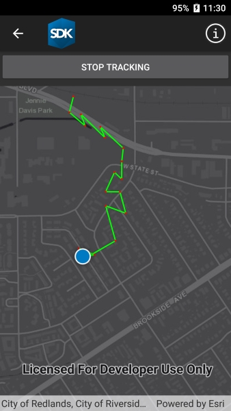

# Show location history

Display your location history on the map.

## Use case

You can track the user's location and display that on a map, for example to visualize how the user has moved through the world or to allow the user to re-trace their steps.

## How to use the sample

Click, 'Start tracking' to start tracking your location, which will appear as points on the map. A line will connect the points for easier visualization. Click 'Stop tracking' to stop updating the location history.

## How it works

1. If necessary, the app requests location permissions from the operating system.
2. Create a graphics overlay to show each point and another graphics overlay for displaying the route line.
3. Create a `SystemLocationDataSource` and start it to begin receiving location updates.
4. Subscribe to the `LocationChanged` event to begin received location updates.
5. Every time the location updates, store that location, display a point on the map, and re-create the route line.

## Relevant API

* Location.Position
* LocationDataSource
* LocationDataSource.LocationChanged
* LocationDataSource.UpdateLocation
* LocationDisplay.AutoPanMode
* LocationDisplay.DataSource
* LocationDisplay.IsEnabled
* MapView.LocationDisplay
* SystemLocationDataSource

## About the data

The sample uses a dark gray basemap with blue and red graphics. A custom location data source that provides fake/random location data is provided to enable easier testing and allow the sample to be useful on desktop/non-mobile devices.

## Tags

GPS, bread crumb, breadcrumb, history, movement, navigation, real-time, trace, track, trail
