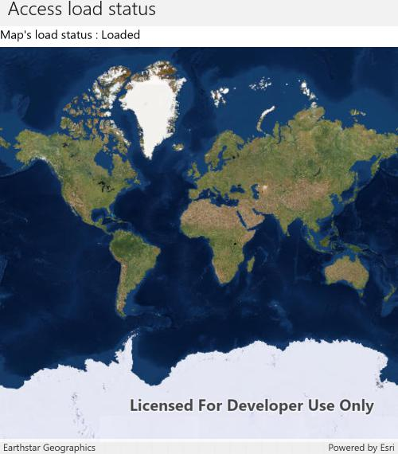

# Access load status

This sample demonstrates how to access the Maps' LoadStatus. The LoadStatus will be considered loaded when the following are true: The Map has a valid SpatialReference and the Map has an been set to the MapView.

