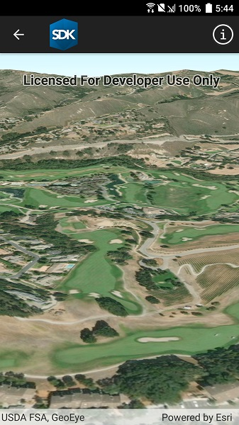

# Create terrain surface from a local raster

Use a terrain surface with elevation described by a raster file.

## How it works

1. Create a `Scene` and add it to a `SceneView`.
2. Create a `RasterElevationSource` with a list of raster file paths.
3. Add this source to the scene's base surface: `Scene.BaseSurface.ElevationSources.Add(rasterElevationSource)`.

## Additional information

The terrain surface is what the basemap, operational layers, and graphics are draped on. 

Supported raster formats include:

* ASRP/USRP
* CIB1, 5, 10
* DTED0, 1, 2
* GeoTIFF
* HFA
* HRE
* IMG
* JPEG
* JPEG 2000
* NITF
* PNG
* RPF
* SRTM1, 2

The raster used in this sample is a DTED2 file.

## Relevant API

* RasterElevationSource
* Surface

## Tags

3D, Raster, Elevation, Surface
