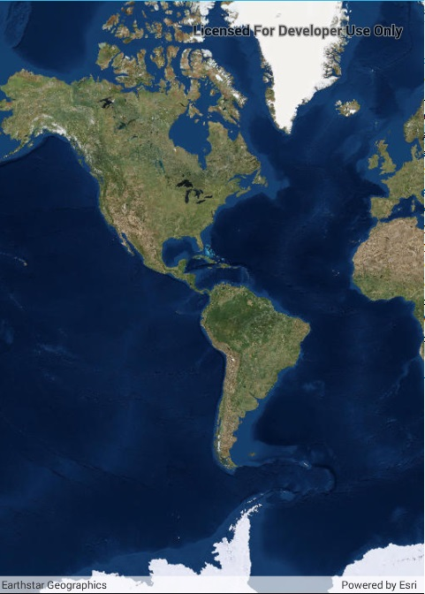

# Display a map

Display a map with an imagery basemap.

## Use case

The map is the fundamental building block of any GIS application and is used to specify how geographic data is organized and communicated to your users.

## How it works

1. Create an `Map` with a `Basemap.CreateImagery()` basemap.
2. Create a `MapView` object to display the map.
3. Set the map to the map view.

## Relevant API

* Map
* Basemap
* MapView

## Tags

MapView, basemap, map
