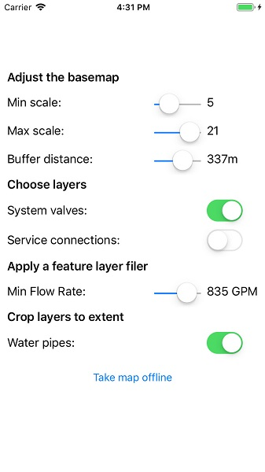

# Generate Offline Map (Overrides)

Use the `OfflineMapTask` with overrides to take a webmap offline. The overrides workflow allows you to adjust the settings used for taking each layer in the map offline. For a simple example of how you take a map offline, please consult the "Generate Offline Map" sample.

## Use case

For applications where you just need to take all layers offline, use the standard workflow (using only `GenerateOfflineMapParameters`). For more fine-grained control over the data you are taking offline, use overrides to adjust the settings for each layer (`GenerateOfflineMapParameters` in conjunction with `GenerateOfflineMapParameterOverrides`).

Consider using the overrides workflow when you need to:

* Adjust the extent for one or more layers to be different to the rest of the map.
* Reduce the amount of data (for example tile data) downloaded for one or more layers in the map.
* Filter features to be taken offline.
* Take features with no geometry offline - for example, features whose attributes have been populated in the office, but which need a site survey for their geometry.

## How to use the sample

1. Tap 'Take map offline'.
2. Adjust the min/max levelIds to be taken offline for the Streets basemap.
3. Set the buffer distance for the streets basemap. 
4. Choose whether to include the System Valves and Service Connections layers. 
5. Specify the minimum flow rate for the features from the Hydrant layer.
6. Use the button to start the job.
7. Wait for the progress bar to indicate that the task has completed. The offline map will then be displayed.

## How it works

1. Create a portal item for the web map you want to take offline.
2. Initialize an `OfflineMapTask` object with the portal item. 
3. Request the default parameters for the task, with the selected extent, by calling `OfflineMapTask.CreateDefaultGenerateOfflineMapParameters`. 
4. Create a set of `GenerateOfflineMapParameterOverrides` by calling `OfflineMapTask.CreateGenerateOfflineMapParameterOverrides`.
5. Adjust the various properties of the parameter overrides.

## Relevant API

* OfflineMapTask
* GenerateGeodatabaseParameters
* GenerateOfflineMapParameters
* GenerateOfflineMapParameterOverrides
* GenerateOfflineMapJob
* GenerateOfflineMapResult
* ExportTileCacheParameters

## Tags

offline, generate, on-demand