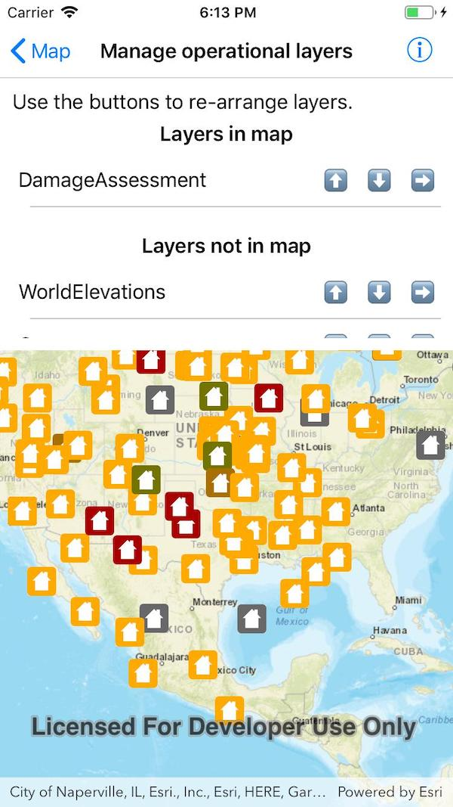

# Manage operational layers

Add, remove, and reorder operational layers in a map.

## How to use the sample

Use the buttons on the layer list entries to re-arrange the layers. Tapping the up or down arrows will move the layers up or down within the lists. Tapping the right arrow will move the layer to the other list.

## How it works

A map's `OperationalLayers` collection controls which layers are visualized. `MapView` automatically updates the visualization when the `Map` changes. A separate collection holds layers that have been removed from the operational layers. 

## Relevant API

* Map
* ArcGISMapImageLayer
* MapView
* MapView.OperationalLayers

## Tags

Map, scene, operational, hide, remove, add
