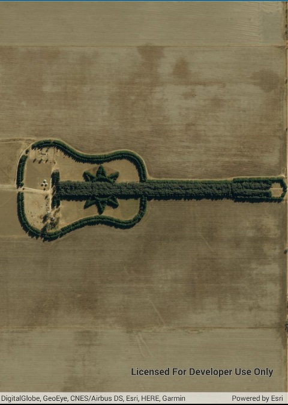

#Set initial map location

This sample demonstrates how to create a map with a standard ESRI Imagery with Labels basemap that is centered on a latitude and longitude location and zoomed into a specific level of detail.

### Instructions

