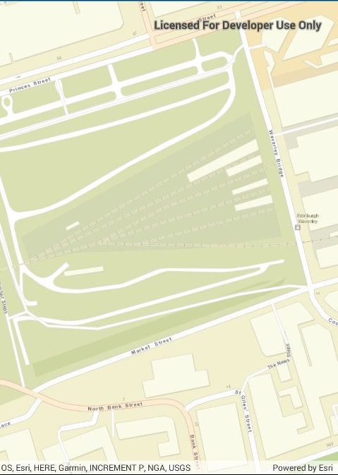

#Set Min & Max Scale

This sample demonstrates how to set the minimum and maximum scale of a Map. Setting the minimum and maximum scale for the Map can be useful in keeping the user focused at a certain level of detail.

### Instructions

