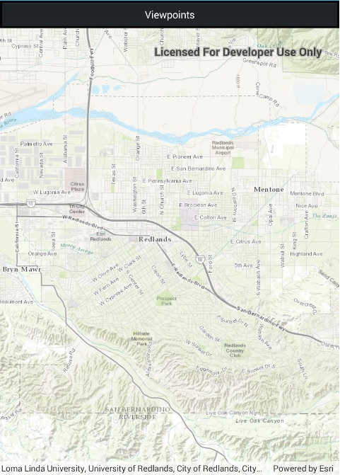

# Change viewpoint

Set the map view to a new viewpoint.

## Use case

Focus on a particular area of interest in a given map or scene.

## How to use the sample

Simply run the app.

## How it works

1. Create a new `Map` object and set it to the `MapView` object.
2. Change the viewpoint with `MapView.SetViewpoint`.

## Relevant API

* Map
* MapView
* Point
* SpatialReference
* Viewpoint

## Tags

SetViewpointAsync, SetViewpointCenterAsync, SetViewpointGeometryAsync, extent, zoom
