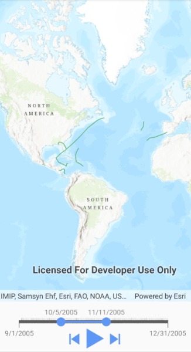

# Filter by time extent

The time slider provides controls that allow you to visualize temporal data by applying a specific time extent to a map view.

## Use case

When viewing feature layers that contain a large amount of data with timestamps, you may want to filter the data to only show data relevant to a specific time range. This can help visualize changes in the data over time and aids in making better interpretations and predictions of future trends.

## How to use the sample

Use the slider at the bottom of the map to customize the date range for which you want to view the data. The date for the hurricanes sample data ranges from September 1st, 2005 to December 31st, 2005. Once the start and end dates have been selected, the map view will update to only show the relevant data that falls in the time extent selected. Use the play button to step through the data one day at a time. Use the previous and next buttons to go back and forth in 2 day increments as demonstrated below.

## How it works

1. Create a `MapView` with a `Map`, and add layers that have time-enabled data.
2. Create a `TimeSlider` from the ArcGIS Runtime Toolkit to allow users to show data only from the given date range. This sets up all necessary calls to visualize and step through the temporal data.

## Relevant API

* FeatureLayer
* Map
* MapView
* ServiceFeatureTable

## Additional information

This sample uses [Atlantic hurricane data](https://www.arcgis.com/home/item.html?id=49925d814d7e40fb8fa64864ef62d55e) from the National Hurricane Center (NOAA / National Weather Service) and the `TimeSlider` toolkit component which requires the [toolkit](https://github.com/Esri/arcgis-toolkit-dotnet) to be cloned and set up locally. For information about setting up the toolkit, see the repository's root README.md [here](https://github.com/Esri/arcgis-toolkit-dotnet/blob/main/README.md).

## Tags

animate, data, filter, time, time extent, time frame, toolkit