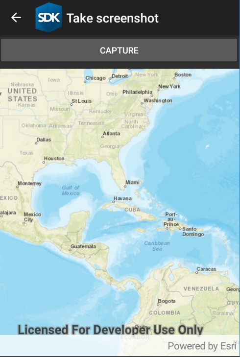

#Take Screenshot

This sample demonstrates how you can take screenshot of a map. Click 'capture' button to take a screenshot of the visible area of the map. Created image is shown in the sample after creation.

### Instructions

