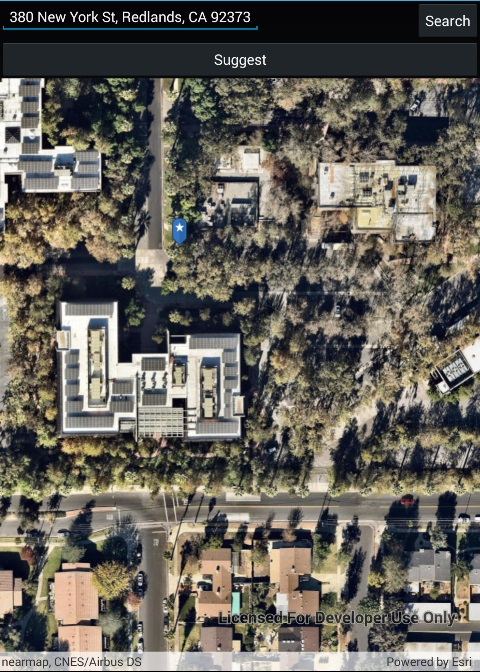

# Find address

This sample demonstrates how you can use the LocatorTask API to geocode an address and display it with a pin on the map. Tapping the pin displays the reverse-geocoded address in a callout.

