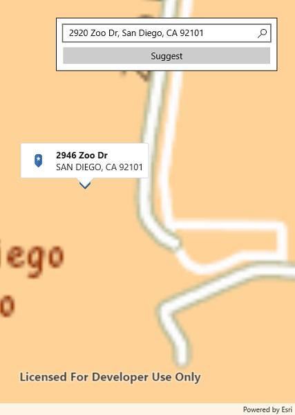

# Offline geocode

Geocode addresses to locations and reverse geocode locations to addresses offline.

## Use case

You can use an address locator file to geocode addresses and locations. For example, you could provide offline geocoding capabilities to field workers repairing critical infrastructure in a disaster when network availability is limited.

## How to use the sample

Type the address in the Search menu option or select from the list to `Geocode` the address and view the result on the map. Tap the location you want to reverse geocode. Tap the pin to see the full address.

## How it works

1. Use the path of a .loc file to create a `LocatorTask` object.
2. Set up `GeocodeParameters` and call `GeocodeAsync` to get geocode results.

## Relevant API

* GeocodeParameters
* GeocodeResult
* LocatorTask
* ReverseGeocodeParameters

## Offline data

This sample downloads the following items from ArcGIS Online automatically:

* [San Diego Streets Tile Package](https://www.arcgis.com/home/item.html?id=22c3083d4fa74e3e9b25adfc9f8c0496) - Streets Tile Package (tpkx) for the City of San Diego.
* [San Diego Offline Locator](https://www.arcgis.com/home/item.html?id=344e3b12368543ef84045ef9aa3c32ba) - Includes San Diego Locator Offline Dataset.

## Tags

geocode, geocoder, locator, offline, package, query, search