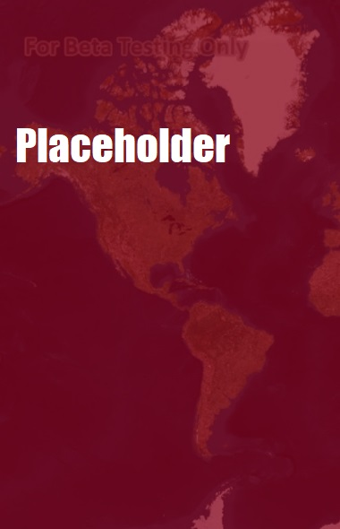

# Navigate map view and identify features with keyboard

Perform all map navigation operations using only the keyboard.

## Use case

Use this pattern when your app must remain fully usable without a pointing device. Supporting keyboard-only pan, zoom, rotate, and identify is a core accessibility requirement for users who rely on assistive technologies or cannot use a mouse, and it also benefits users who prefer keyboard-driven workflows.

## How to use the sample

When the sample is launched, a fixed area of interest appears centered over the map, and any features inside it are automatically selected and labeled <kbd>1</kbd> – <kbd>9</kbd>. As you navigate, the selection and labels update to match the features currently inside the area of interest. Use the arrow keys to pan and <kbd>+</kbd> / <kbd>-</kbd> to zoom. Use <kbd>Alt</kbd> + <kbd>←</kbd> / <kbd>→</kbd> to rotate, with <kbd>Alt</kbd> + <kbd>↑</kbd> resetting the map to north. Press <kbd>1</kbd> – <kbd>9</kbd> to show a callout for the matching numbered feature, and press <kbd>Esc</kbd> to dismiss the callout.

## How it works

1. Create a `Map` with a basemap and add a `FeatureLayer`.
2. Overlay a fixed-size rectangle on the `MapView` to mark the area of interest.
3. Listen for `GeoView.NavigationCompleted` to re-run the selection after every pan, zoom, or rotation.
4. Convert the rectangle's screen bounds to a map-space `Envelope` using `MapView.ScreenToLocation` and `GeometryEngine.Distance`.
5. Build `QueryParameters` with the envelope geometry and `SpatialRelationship.Intersects`, then call `FeatureTable.QueryFeaturesAsync`.
6. Call `FeatureLayer.SelectFeature` on each returned feature, and add a numbered `TextSymbol` graphic to a `GraphicsOverlay` at each feature's location.
7. Handle keyboard input to show callouts via the number keys and to dismiss the callout on <kbd>Esc</kbd>.

## Relevant API

* Envelope
* FeatureLayer
* Graphic
* GraphicsOverlay
* Map
* MapView

## About the data

This sample uses a [Redlands restaurants](https://www.arcgis.com/home/item.html?id=46119989eccd46a58b8f3d7aedadeb90) feature layer covering food establishments in Redlands, California. Each feature represents a single restaurant.

## Additional information

The map view supports built-in keyboard shortcuts for pan (arrow keys), zoom (<kbd>+</kbd> / <kbd>-</kbd>), rotate (<kbd>Alt</kbd> + <kbd>←</kbd> / <kbd>→</kbd>), and reset to north (<kbd>Alt</kbd> + <kbd>↑</kbd>). On macOS, use <kbd>Option</kbd> in place of <kbd>Alt</kbd>. See [Navigate a map view](https://developers.arcgis.com/net/maps-2d/navigate-a-map-view/) for the complete list of built-in interactions.

## Tags

accessibility, accessible, identify, inclusive, input, interaction, keyboard, navigation, selection, WCAG