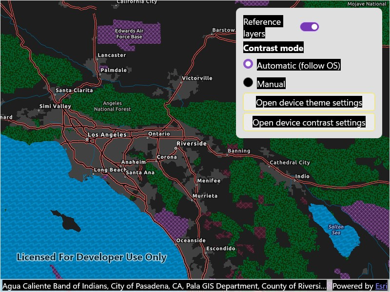

# Update basemap for contrast accessibility

Display a map view that updates between authored light, dark, and high-contrast basemaps.

## Use case

Use this pattern when your app needs contrast-responsive basemaps to switch between light, dark, and high-contrast states. This is especially useful with basemaps authored for accessibility, along with reference layers for the associated base layer.

## How to use the sample

When the sample is launched, it displays the chosen contrast basemap. When automatic mode is selected, changing the device theme between light and dark, or turning high contrast on and off, will result in the appropriate basemap being loaded to match settings. Toggle the device settings to see the different basemaps.

Switch to manual mode to choose Light, Dark, High contrast light, or High contrast dark directly. Show or hide the basemap's reference layers to compare how labels and boundaries read in each contrast appearance mode.

## How it works

1. Provide four authored basemaps that represent the supported contrast appearances: Light, Dark, High contrast light, and High contrast dark.
2. Resolve which contrast appearance should be active based on the current mode and OS settings.
    * In manual mode, use the appearance selected in the supporting pane.
    * In automatic mode, resolve the appearance from the OS theme and high-contrast state. The sample subscribes to MAUI's `Application.Current.RequestedThemeChanged` for theme changes, and to each platform's native high-contrast notification: `Microsoft.UI.System.ThemeSettings.Changed` on Windows, `UIApplication.DarkerSystemColorsStatusDidChangeNotification` on iOS and Mac Catalyst, and `UiModeManager.AddContrastChangeListener` plus a `ContentObserver` on the `high_text_contrast_enabled` `Settings.Secure` key on Android.
3. Map the resolved appearance to a `Basemap` from either a `BasemapStyle` or a portal item, and assign it to the `Map`'s `Basemap` property.
4. Apply the current reference-layer visibility setting to the basemap's labels and boundary layers.

## Relevant API

* Basemap
* BasemapStyle
* Map

## About the data

This sample uses four ArcGIS Living Atlas web maps authored for regular light, regular dark, high-contrast light, and high-contrast dark presentation states.

* [Enhanced Contrast Map](https://www.arcgis.com/home/item.html?id=084291b0ecad4588b8c8853898d72445)
* [Enhanced Contrast Dark Map](https://www.arcgis.com/home/item.html?id=3e23478909194c54992eaaee78b5f754)
* [Dark Gray Canvas](https://www.arcgis.com/home/item.html?id=358ec1e175ea41c3bf5c68f0da11ae2b)
* [Light Gray Canvas](https://www.arcgis.com/home/item.html?id=979c6cc89af9449cbeb5342a439c6a76)

The enhanced contrast web maps are designed for accessibility-focused presentation workflows, and the light and dark canvas maps provide the regular contrast companions. You can use these web maps as a starting reference for your own contrast-specific basemap workflows.

## Additional information

For more background on the cartographic approach behind the enhanced contrast basemaps, see [Working with Enhanced Contrast basemaps to improve accessibility](https://www.esri.com/arcgis-blog/products/arcgis-living-atlas/mapping/working-with-enhanced-contrast-basemaps-to-improve-accessibility/).

The OS-level "high contrast" affordance maps to a slightly different concept on each platform: a full system theme on Windows, an "Increase Contrast" boost on iOS and Mac Catalyst, and either the Android 14+ system "Color contrast" slider or the legacy "high contrast text" accessibility option on older Android versions. The sample treats all of these as the trigger to switch to the enhanced-contrast basemap. The light/dark theme follows `Application.Current.RequestedTheme` on all platforms.

## Tags

accessibility, accessible, basemap, colorblind, contrast, dark, enhanced, high, inclusive, legibility, light, living atlas, readability, vision, visual impairment, WCAG
