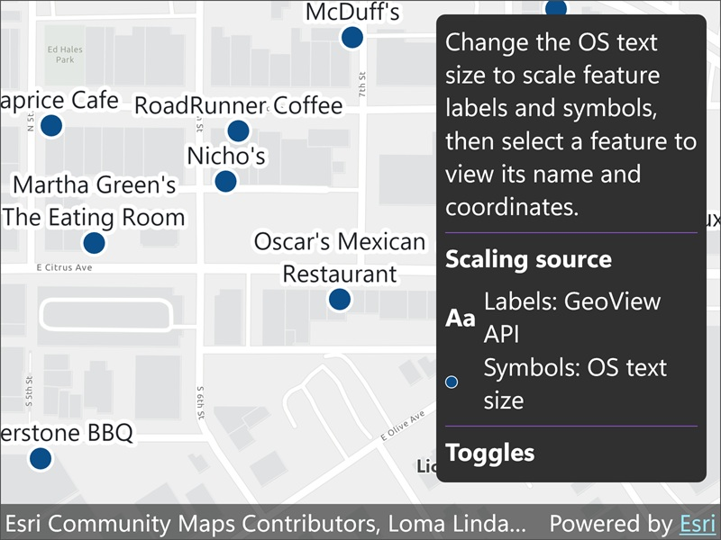

# Update labels and symbols to scale for visual accessibility

Scale feature labels and symbols according to the system text-size setting, with an app-controlled text-scaling workaround on Mac Catalyst.

## Use case

Use this pattern to improve map readability for users who need larger text. On Windows, Android, and iOS, enable `GeoView.UseSystemTextScale` to scale feature labels automatically, and apply the reported system scaling factor to feature symbol sizes. On Mac Catalyst, provide an in-app scale and manually resize label symbols and custom callout content using existing public APIs.

## How to use the sample

Change the text size in the operating system's accessibility settings to see the restaurant labels and symbols resize. Use **Open OS text-size settings** on Windows or Android. On iOS, open **Settings** > **Accessibility** > **Display & Text Size** > **Larger Text**.

On Mac Catalyst, use **App text scale** to choose 100–200%. Labels, markers, marker outlines, and restaurant callout text resize immediately. This is an application-controlled workaround; it does not detect or follow the macOS text-size setting.

Clear **Apply text scale to labels** to keep labels at their baseline size, then select it again to restore scaling. Restaurant symbols and callouts continue to follow the selected scale independently of this setting. The legend and current values show how labels and symbols are scaled.

Select a restaurant to show its name and WGS 84 coordinates in a callout. Select elsewhere to clear the callout.

## How it works

1. Create a `Map` and add a `FeatureLayer`.
2. Create a `SimpleMarkerSymbol` and apply it to the feature layer with a `SimpleRenderer`.
3. Load the feature layer, then add a `LabelDefinition` with a `TextSymbol`.
4. On Windows, Android, and iOS, enable `GeoView.UseSystemTextScale` to scale labels automatically. Under `#if MACCATALYST`, disable it to avoid double scaling and instead multiply the retained `TextSymbol.Size` and `HaloWidth` by the app scale.
5. To scale symbols, read the platform's system text-scale factor, subscribe to text-scale changes, and apply the factor to the symbol size and outline width.
6. Use the checkbox to toggle label scaling without changing symbol or callout scaling. On Catalyst, the retained label symbol is created before asynchronous layer loading so early slider changes are preserved.
7. Identify a restaurant with `IdentifyLayerAsync` and show its name and WGS 84 coordinates in a callout. On Catalyst, use the existing `GeoView.ShowCalloutAt(MapPoint, VisualElement)` overload with custom MAUI labels. Set their font sizes to 17 and 15 times the app scale, disable `FontAutoScalingEnabled`, and measure the wrapped content after creating its MAUI handlers. Re-show visible content at the same anchor to update its layout and measured height.

## Relevant API

* GeoView.UseSystemTextScale
* GeoView.ShowCalloutAt
* TextSymbol.Size
* TextSymbol.HaloWidth

## About the data

This sample uses a [Redlands restaurants](https://www.arcgis.com/home/item.html?id=46119989eccd46a58b8f3d7aedadeb90) feature layer covering food establishments in Redlands, California. Each feature represents a single restaurant.

## Additional information

Symbols use `UISettings.TextScaleFactor` with `UISettings.TextScaleFactorChanged` on Windows, `Configuration.FontScale` with `IComponentCallbacks.OnConfigurationChanged` on Android, and `UIFontMetrics.GetScaledValue` with `ObserveContentSizeCategoryChanged` on iOS. The Catalyst sample uses only its app slider and does not subscribe to UIKit content-size notifications.

The Catalyst workaround is local to this sample's restaurant labels, symbols, and custom callouts. It does not scale basemap labels, other layers, or arbitrary text rendered by the SDK. It needs no SDK modifications or package-version change.

On Android, include `ConfigChanges.FontScale` in the existing `ConfigurationChanges` flags of the `[Activity]` attribute in `Platforms/Android/MainActivity.cs`. This lets the activity handle font-size changes without being recreated, while the sample's `IComponentCallbacks.OnConfigurationChanged` callback updates the symbols.

## Tags

accessibility, label, readability, scale, symbol, text, visual impairment
