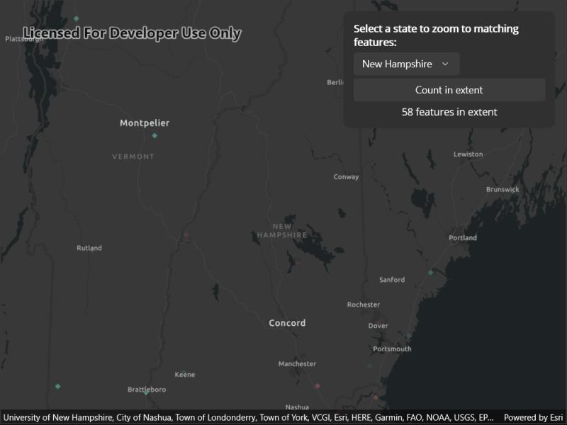

# Query feature count and extent

Zoom to features matching a query and count the features in the current visible extent.

## Use case

Queries can be used to search for features in a feature table using text entry. This is helpful for finding a specific feature by name in a large feature table. A query can also be used to count features in an extent. This could be used to count the number of a traffic incidents in a particular region when working with an incident dataset for a larger area.

## How to use the sample

Use the picker to zoom to the extent of the state specified. Use the button to count the features in the current extent.

## How it works

Querying by state abbreviation:

1. A `QueryParameters` object is created with a `WhereClause`.
2. `FeatureTable.QueryExtentAsync` is called with the `QueryParameters` object to obtain the extent that contains all matching features.
3. The extent is converted to a `Viewpoint`, which is passed to `MapView.SetViewpointAsync`.

Counting features in the current extent:

1. The current visible extent is obtained from a call to `MapView.GetCurrentViewpoint(ViewpointType)`.
2. A `QueryParameters` object is created with the visible extent and a defined `SpatialRelationship` (in this case 'intersects').
3. The count of matching features is obtained from a call to `FeatureTable.QueryFeatureCountAsync`.

## Relevant API

* FeatureTable.QueryExtentAsync
* FeatureTable.QueryFeatureCountAsync
* MapView.GetCurrentViewpoint(ViewpointType)
* QueryParameters
* QueryParameters.Geometry
* QueryParameters.SpatialRelationship
* QueryParameters.WhereClause

## About the data

See the [Medicare Hospital Spending per Patient, 2016](https://www.arcgis.com/home/item.html?id=c8810b20c01b4e8ba5cd848966a66d7b#overview) layer on ArcGIS Online.

Hospitals in blue/turquoise spend less than the national average. Red/salmon indicates higher spending relative to other hospitals, while gray is average.

## Tags

count, feature layer, feature table, features, filter, number, query
