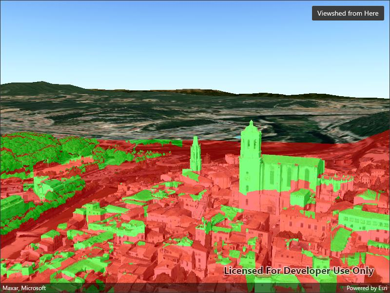

# Show exploratory viewshed from camera in scene

Analyze the exploratory viewshed for a camera showing the visible and obstructed areas from an observer's vantage point.

## Use case

An exploratory viewshed analysis is a type of visual analysis you can perform at the current rendered resolution of a scene. The exploratory viewshed aims to answer the question 'What can I see from a given location?'. The output is an overlay with two different colors - one representing the visible areas (green) and the other representing the obstructed areas (red).

Note: This analysis is a form of "exploratory analysis", which means the results are calculated on the current scale of the data, and the results are generated very quickly but not persisted. If persisted analysis performed at the full resolution of the data is required, consider using a `ViewshedFunction` to perform a viewshed calculation instead.

## How to use the sample

The sample will start with an exploratory viewshed created from the initial camera location, so only the visible (green) portion of the exploratory viewshed will be visible. Move around the scene to see the obstructed (red) portions. Tap the 'Update from Camera' button to update the exploratory viewshed to the current camera position.

## How it works

1. Create an `ExploratoryLocationViewshed`, passing in the initial `Camera` and a min/max distance.
2. Update the viewshed using `ExploratoryLocationViewshed.UpdateFromCamera()`.

## Relevant API

* AnalysisOverlay
* ArcGISScene
* ArcGISTiledElevationSource
* Camera
* ExploratoryLocationViewshed
* IntegratedMeshLayer
* SceneView

## About the data

The scene shows an integrated mesh layer of [Girona, Spain](https://www.arcgis.com/home/item.html?id=5c55d0d1f21e489193cdeff11460a28c) with the [World Elevation source image service](https://elevation3d.arcgis.com/arcgis/rest/services/WorldElevation3D/Terrain3D/ImageServer) both hosted on ArcGIS Online.

## Tags

3D, exploratory viewshed, integrated mesh, scene, visibility analysis
