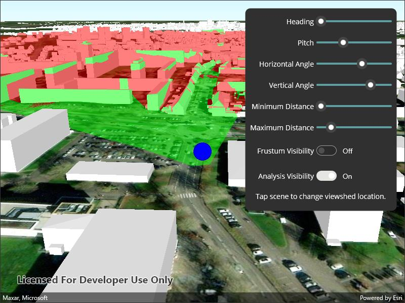

# Show exploratory viewshed from point in scene

Perform an exploratory viewshed analysis from a defined vantage point.

## Use case

An exploratory viewshed analysis is a type of visual analysis you can perform at the current rendered resolution of a scene. The exploratory viewshed shows what can be seen from a given location. The output is an overlay with two different colors - one representing the visible areas (green) and the other representing the obstructed areas (red).

Note: This analysis is a form of "exploratory analysis", which means the results are calculated on the current scale of the data, and the results are generated very quickly but not persisted. If persisted analysis performed at the full resolution of the data is required, consider using a `ViewshedFunction` to perform a viewshed calculation instead.

## How to use the sample

Use the sliders to change the properties (heading, pitch, etc.), of the exploratory viewshed and see them updated in real time. To move the exploratory viewshed, double touch and drag your finger across the screen. Lift your finger to stop moving the exploratory viewshed.

## How it works

1. Create an `ExploratoryLocationViewshed` passing in the observer location, heading, pitch, horizontal/vertical angles, and min/max distances.
2. Set the property values on the exploratory viewshed instance for location, direction, range, and visibility properties.

## Relevant API

* AnalysisOverlay
* ArcGISSceneLayer
* ArcGISTiledElevationSource
* ExploratoryLocationViewshed
* ExploratoryViewshed

## About the data

The scene shows a [buildings layer in Brest, France](https://www.arcgis.com/home/item.html?id=b343e14455fe45b98a2c20ebbceec0b0) hosted on ArcGIS Online.

## Tags

3D, exploratory viewshed, frustum, scene, visibility analysis
