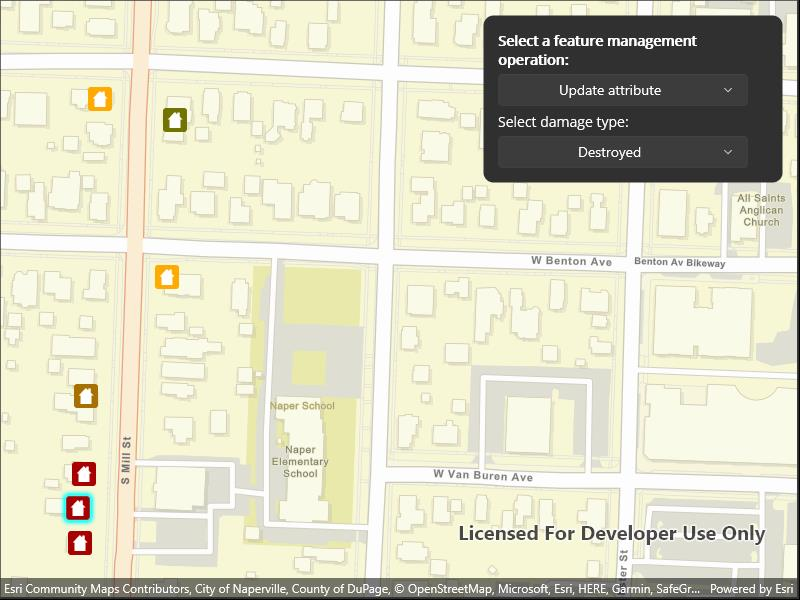

# Manage features

Manage a feature layer's features in four distinct ways.

## Use case

An end-user performing a survey may want to manage features on the map in various ways during the course of their work.

## How to use the sample

Pick an operation, then tap a location on the map to perform the operation at that location. Available feature management operations include "Create feature", "Delete feature", "Update attribute", and "Update geometry".

## How it works

A `Feature` instance is added to a `ServiceFeatureTable` which then pushes that new feature to the server.

1. Create a `ServiceGeodatabase` from a URL.
   * When the table loads, you can get the domain to determine which options to present in your UI.
2. Get a `ServiceFeatureTable` from the `ServiceGeodatabase`.
3. Create a `FeatureLayer` derived from the `ServiceFeatureTable` instance.
4. Create a `Picker` populated with the four feature management operations. Selecting a new operation changes the `GeoViewTappedEvent` subscription accordingly.
5. Create a `Feature` with attributes and a location using the `ServiceFeatureTable`.
6. *Apply edits* intended by the selected option to the `ServiceGeodatabase` upon tapping the map.
7. After the change, update the table on the server using `ApplyEditsAsync`.

## Relevant API

* Feature
* FeatureEditResult
* FeatureLayer
* ServiceFeatureTable
* ServiceGeodatabase

## Additional information

When editing feature tables that are subject to database behavior (operations on one table affecting another table), it's now recommended to call these methods (apply or undo edits) on the `ServiceGeodatabase` object rather than on the `ServiceFeatureTable` object. Using the `ServiceGeodatabase` object to call these operations will prevent possible data inconsistencies and ensure transactional integrity so that all changes can be commited or rolled back.

## Tags

amend, attribute, deletion, details, edit, editing, feature, feature layer, feature table, information, moving, online service, service, updating, value
