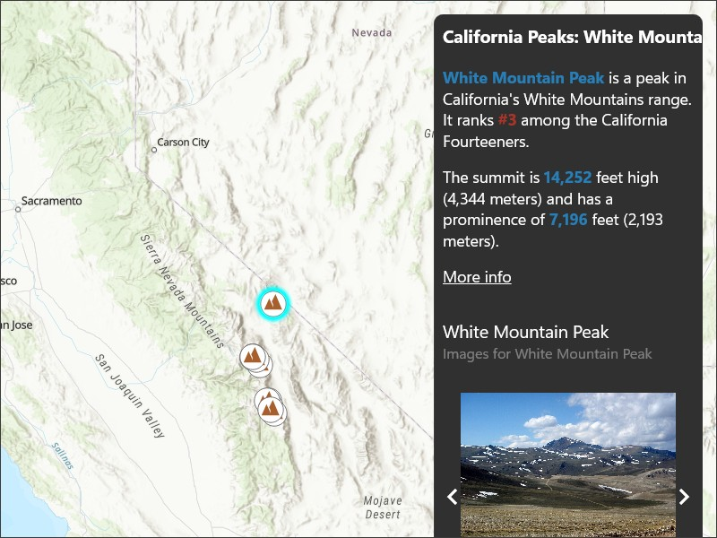

# Show popup

Show predefined popups from a web map.

## Use case

Many web maps contain predefined popups which are used to display the attributes associated with each feature layer in the map, such as hiking trails, land values, or unemployment rates. You can display text, attachments, images, charts, and web links. Rather than creating new popups to display information, you can easily access and display the predefined popups.

## How to use the sample

Tap on the features to prompt a popup that displays information about the feature.

## How it works

1. Create and load a `Map` using a URL.
2. Set the map to a `MapView` and listen for its `GeoViewTapped` event.
3. Use the `GeoView.IdentifyLayerAsync()` method to identify the top-most feature.
4. Set the first `Popup` from the result's `IdentifyLayerResult.Popups` collection on a `PopupViewer`.
5. Display the popup viewer.

## Relevant API

* IdentifyLayerResult
* Map
* PopupViewer

## About the data

The [California Peaks layer](https://arcgis.com/home/item.html?id=f7a011555feb423397601a47a56665d8) contains point features for every mountain peak in California with an elevation that exceeds 14,000 feet (4,267.2 meters) above mean sea level. Each feature contains a predefined popup with information about its associated peak, including an image, chart, and feature table data.

## Tags

feature, feature layer, popup, web map
