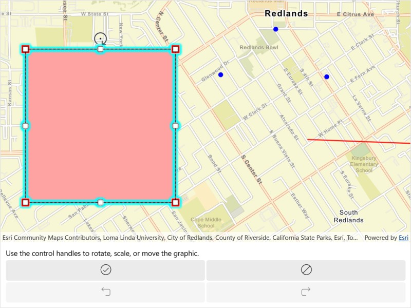

# Display geometry editor information during interaction

Use the geometry editor to see information about the geometry editor's previewed geometry during an editing interaction.

## Use case

A field worker can see information about the geometry being created or edited during an editing interaction. This information can be used provide feedback to the user about the geometry so that they can see the effects of their interaction on the geometry as the interaction progresses.

## How to use the sample

Tap a graphic to edit its geometry by moving, rotating, or scaling the geometry. During the interaction, information about the geometry will be displayed to provide feedback to the user.

Use the buttons in the settings view to undo or redo changes made to the geometry and the cancel and done buttons to discard and save changes, respectively.

## How it works

1. Create a `GeometryEditor` and set it to the MapView using `MyMapView.GeometryEditor`.
2. Start the `GeometryEditor` using `GeometryEditor.Start(Geometry)` to edit an existing geometry.
    * If using the Geometry Editor to edit an existing geometry, the geometry must be retrieved from the graphics overlay being used to visualize the geometry prior to calling the start method. To do this:
        * Use `MapView.IdentifyGraphicsOverlayAsync(...)` to identify graphics at the location of a tap.
        * Access the `MapView.IdentifyGraphicsOverlayAsync(...)`.
        * Find the desired graphic in the `results.FirstOrDefault()` list.
        * Access the geometry associated with the `Graphic` using `Graphic.Geometry` - this will be used in the `GeometryEditor.Start(Geometry)` method.
3. Add an event handler to listen to `GeometryEditor.InteractionPreviewChanged`.
    * This event can be used to get information on the state of the geometry during an interaction with the `GeometryEditorInteractionPreview` parameter.
        * The `PreviewGeometry` represents the geometry's state at that moment.
        * The `InteractionType` can be used to determine the type of interaction that is occurring (`Create`, `Move`, `Rotate`, `Scale`).
        * The `InteractionElement` can be used to determine the element being interacted with (`GeometryEditorVertex`, `GeometryEditorPart`, `GeometryEditorGeometry`).
4. Check to see if undo and redo are possible during an editing session using `GeometryEditor.CanUndo` and `GeometryEditor.CanRedo`. If it's possible, use `GeometryEditor.Undo()` and `GeometryEditor.Redo()`.
5. Call `GeometryEditor.Stop()` to finish the editing session and store the `Graphic`. The `GeometryEditor` does not automatically handle the visualization of a geometry output from an editing session. This must be done manually by propagating the geometry returned into a `Graphic` added to a `GraphicsOverlay`.
    * To update the geometry underlying an existing `Graphic` in the `GraphicsOverlay`:
        * Replace the existing `Graphic`'s `Geometry` property with the geometry returned by the `GeometryEditor.Stop()` method.

## Relevant API

* Geometry
* GeometryEditor
* GeometryEditorInteractionPreview
* GeometryEditorInteractionType
* GeometryEditor.InteractionPreviewChanged
* Graphic
* GraphicsOverlay

## Additional information

The `GeometryEditor.InteractionPreviewChanged` event fires continuously during an interaction, therefore it's not recommended to use it as a trigger for resource intensive actions.

## Tags

draw, edit, geometry editor, interaction preview
