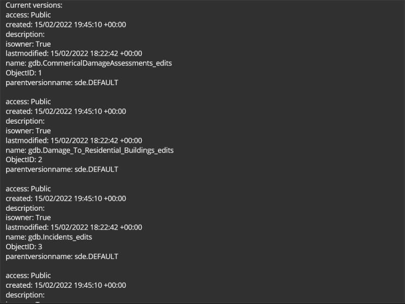

# List geodatabase versions

Connect to a service and list versions of the geodatabase.

## Use case

As part of a multi-user editing scenario, you can check with the server to see how many versions of the geodatabase are outstanding before syncing.

## How to use the sample

When the sample loads, a list of geodatabase versions and their properties will be displayed.

## How it works

1. Create a geoprocessing task referring to a **GPServer** with a **ListVersions** task.
2. Use the task to create default parameters.
3. Use the created parameters to create a job.
4. Run the job to get a `GeoprocessingResult`.
5. Get a list of geoprocessing features from the **Versions** output parameter of the results.
6. Format the geodatabase versions for display.

## Relevant API

* GeoprocessingFeatures
* GeoprocessingFeatures.Features
* GeoprocessingJob
* GeoprocessingJob.GetResultAsync
* GeoprocessingParameters
* GeoprocessingResult
* GeoprocessingResult.Outputs
* GeoprocessingTask
* GeoprocessingTask.CreateDefaultParametersAsync
* GeoprocessingTask.CreateJob

## About the data

The sample uses a [sample geoprocessing service](https://sampleserver6.arcgisonline.com/arcgis/rest/services/GDBVersions/GPServer/ListVersions) hosted on ArcGIS Online.

## Additional information

ArcGIS Server does not include a geoprocessing service for listing geodatabase versions. You must configure one using the steps defined in [Geoprocessing service example: list, create, and delete geodatabase versions](http://desktop.arcgis.com/en/arcmap/latest/analyze/sharing-workflows/gp-service-example-list-create-and-delete-geodatabase-versions.htm) in the *ArcMap* documentation.

## Tags

conflict resolution, data management, database, multi-user, sync, version