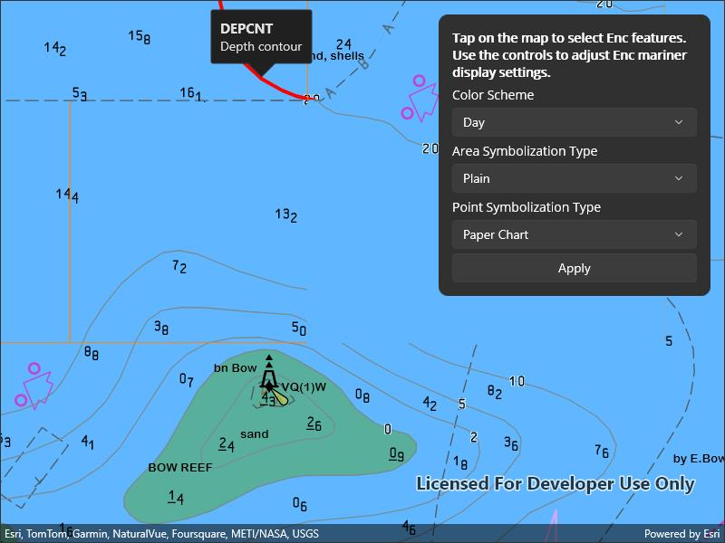

# Configure electronic navigational charts

Display and configure electronic navigational charts per ENC specification.

## Use case

The S-52 standard defines how Electronic Navigational Chart (ENC) content should be displayed to ensure that data is presented consistently across every charting system. S-52 defines several display options, including variations on symbology to ensure that charts are readable both at night and in direct sunlight.

## How to use the sample

Tap to select ENC features. Feature properties will be displayed in a callout.

## How it works

1. Load and display the ENC layer.
2. When the map view is tapped, call `mapView.IdentifyLayersAsync()`, specifying the tapped position, a tolerance, and false for the `popupsOnly` parameter.
3. Filter the list of identified layers to include only results where the `LayerContent` is an `EncLayer`.
4. Get the first result with at least one feature.
5. Get the first feature in the `IdentifyLayerResult`.
6. Select that feature by calling `identifyResult.LayerContent.SelectFeature(firstFeature)`.
7. Show the feature's acronym and description in a callout.

## Relevant API

* EncFeature
* EncFeature.Acronym
* EncFeature.Description
* EncLayer
* GeometryEngine.Area
* IdentifyLayerResult
* IdentifyLayerResult.GeoElements
* IdentifyLayerResult.LayerContent

## Offline data

This sample downloads the [ENC Exchange Set without updates](https://www.arcgis.com/home/item.html?id=9d2987a825c646468b3ce7512fb76e2d) item from *ArcGIS Online* automatically.

The latest Hydrography Data can be downloaded from the [*Esri Developer* downloads](https://developers.arcgis.com/downloads/). The `S57DataDictionary.xml` file is contained there.

## Additional information

Read more about [displaying](https://developers.arcgis.com/swift/layers/display-electronic-navigational-charts/) and [deploying](https://developers.arcgis.com/swift/license-and-deployment/deployment/#enc-electronic-navigational-charts-style-directory) electronic navigational charts on *Esri Developer*.

## Tags

ENC, hydrography, identify, IHO, layers, maritime, nautical chart, S-52, S-57, select, settings, symbology